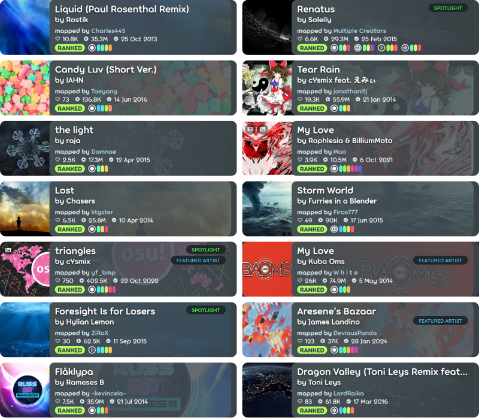
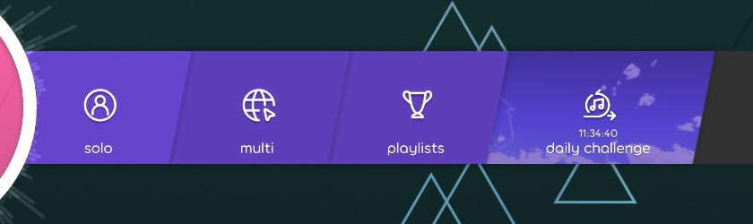

---
authors:
  - name: Walavouchey
  - name: "0x84f"
tags: [Lazer updates, 更新日志]
date: 2024-05-19T20:43
slug: lazer-update-20240519
hide_table_of_contents: false
enableComments: true
---

# osu!(lazer) 更新：2024 年 5 月 19 日

获取每月最新、最棒的 osu!(lazer) 更新！

开发人员收集了社区迄今为止提交的所有反馈，并努力实现了许多要求的功能！您可以继续阅读，查看一些重点更改，或观看下面的视频摘要！<!-- truncate -->

    <iframe src="https://player.bilibili.com/player.html?isOutside=true&aid=1154824398&bvid=BV1iZ421s72W&cid=1552673264&p=1" scrolling="no" border="0" frameborder="no" framespacing="0" allowfullscreen="true"></iframe>

## 较小的变化

- **各种性能改进**。开发人员一直在不断改进 osu！框架，以确保在尽可能多的系统上实现足够的性能。其中包括对 Direct3D 渲染器的错误修复，如果您在使用过程中遇到问题，请尝试一下！
- **使用 Classic 模组时，滑块头部命中不会显示在时偏分布图中**。这修复了在开启 Classic 模组时，时偏分布图在同一列上显示多种颜色（多种判定类型）的问题。
- **国旗现在可以用占位符图标隐藏**。应用户要求，这是为那些在某些司法管辖区因国旗法而遇到问题的内容创作者而设计的。我们不是旗帜学家，也不是律师，但可以肯定地说，国旗法可能很棘手。
- **降低了新安装游戏时的启动音量**。现在，世界上又少了一款在首次运行时会震耳欲聋的游戏。
- **词语过滤器现在可以在 osu！(lazer) 中使用了**。无论是多人房间名称还是聊天对话，都会自动过滤掉露骨的内容。
- **在游戏过程中隐藏 HUD 将不再隐藏游戏区域层中的皮肤元素**。这样，即使隐藏 HUD，玩家也可以更灵活地选择需要保留的基本元素（如打击偏差条）。
- **专为手机 osu！mania 设计触摸区域**。显然，手机游戏玩家的数量已经令人吃惊。新的触摸屏输入系统是第一步，不过目前触摸区域的大小和位置还不能自定义（但将来可以！）。
- **现在，皮肤元素在放置时，其锚点会跟随原点**。如果你对什么是锚点和原点感到困惑，[pishifat](https://osu.ppy.sh/users/3178418) 会在[上述视频的 0:40](https://www.bilibili.com/video/BV1iZ421s72W/?t=40) 处以直观的方式向你解释。
- **自上次更新以来，又部署了 77 枚秘密奖章**。它们正逐步从 osu! (stable) 移植过来。

## 新的捆绑谱面

除了[教程](https://osu.ppy.sh/beatmapsets/1011011#osu/2116202)之外，这些谱面一直都会下载：

上面还会添加随机的[谱师工会](https://osu.ppy.sh/wiki/Community/Mappers_Guild)的谱面。

随机谱面的选择标准如下：

- 授权歌曲
- 60 至 240 秒之间
- 包括 Easy/Normal/Hard/Insane 难度
- 背景明确允许在 osu 中使用！
- 无露骨或AI内容
- 不重复歌曲（在每个游戏模式内）

## osu! Logo 更新

新的 osu! Logo “o”中的圆点极具争议性，在新Logo使用之初，是否应该去掉圆点还是保持原样在社区内引发了激烈的争论。最终，“o”中的圆点被移除，并做了一些小调整。

上次更新的新闻帖子中提供了更多[有关 Logo 的背景信息和投票结果](https://osu.ppy.sh/home/news/2024-04-13-osu-lazer-updates-april-13-2024#the-cookie-question)，供那些没有收到讨论风声的人参考。

## 未来的“每日谱面”功能

这并不是本次更新的变化，但在[上次更新](https://www.bilibili.com/video/BV1Hz421C7ny)呼吁提出 Lazer 开发的下一个重点后，YouTube 上的热门评论：

（这是一项正在进行中的工作。）

---

对发生的每一项更改都很好奇？请查看[更新日志](https://osu.ppy.sh/home/changelog/lazer/2024.519.0)！除此之外，[你知道该怎么做](https://osu.ppy.sh/home/download)。下次再见！

—Walavouchey & 0x84f
