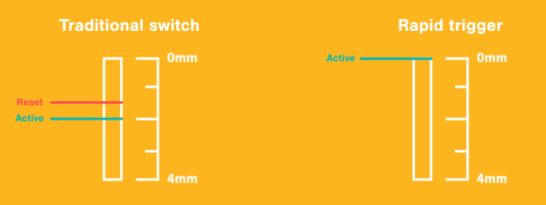

---
authors:
  - name: "0x84f"
tags: [技术, technology, 历史, history]
date: 2023-12-22T12:00
slug: tech-history
enableComments: true
---

# 外设发展对社区的影响

让我们简单回顾一下 osu! 过去的 15 年，看看各种新技术是怎样影响游戏和社区的。

<!-- truncate -->

每隔一段时间，就会出现一种新的技术，无论是新的输入设备，还是榨干电脑性能提高 FPS 的新方法，亦或是全新的游玩方式，都会改变游戏的玩法。

尽管 osu! 社区在面对如 VR、AR 和云游戏等创新时坚定不移（因为 osu! 目前暂时还用不到它们），但仍有一些创新改变了游戏的玩法，或至少动摇了关于玩游戏最优方式的观点。

闲话少说，让我们从头开始，谈谈第一个被广泛接受的备用输入设备的例子，然后继续慢慢展开。

## 数位板 (2007)

osu! 最初是[*押忍！战斗！应援团*](https://en.wikipedia.org/wiki/Osu!_Tatakae!_Ouendan)的 PC 克隆版，这是一款只能在任天堂 DS 上使用触控笔游玩的游戏。当 [peppy](https://osu.ppy.sh/users/2) 发布 osu! 时，拥有数位板的玩家自然会在 osu! 还不为人所知的情况下，先用数位板去试玩。从一开始，它就被认为是一种广泛使用的输入设备，可以更真实地还原任天堂 DS 的游戏体验。

用数位板玩与用鼠标玩完全是两回事。尽管数位板在某些方面（也就是通过绝对位置光标输入，消除了鼠标漂移的影响）形成了降维打击，但它在最佳用法方面也带来了新的挑战与问题。一些玩家依然在用更直观常见的鼠标，可能是为了避免初期的学习曲线；而数位板玩家则要确定游玩方式上的一些细节，比如最理想的握笔或映射区域，以及决定选择贴板还是悬板。

多年来，许多顶尖玩家与常规玩家都开始转向使用数位板，以避免与鼠标相关的问题。然而一直以来，在排行榜榜首都能看到鼠标玩家与数位板玩家的身影，因为这两种外设都被认为适合竞技游戏，各有其优点和缺点。

[Willy](https://osu.ppy.sh/users/3521482) 的一段精彩视频概述了以上所有内容，以及关于将数位板用作 osu! 输入设备的更多内容。

    <iframe width="95%" style={{aspectRatio: "16 / 9"}} src="https://www.youtube.com/embed/V3K3C94fs1o" frameborder="0" allowfullscreen></iframe>

## 游戏机械键盘 (2010)

机械键盘已经存在几十年了。然而，当 Razer [将游戏与机械轴体引人注目地包装到一起](https://press.razer.com/product-news/the-worlds-first-mechanical-keyboard-designed-for-gaming-launched-at-gamescom-2010/)后，它引发了一连串反应，从而形成了我们今天所知的机械键盘市场。

到 2010 年，osu! 玩家已经从用鼠标点击圆圈转向用他们的 `Z` 和 `X` 键进行操作，因此随着这些新的机械键盘愈加便宜、入手愈加容易，玩家将它们纳入自己的外设套装中不无道理。虽然没有什么能阻止任何人用薄膜键盘玩 osu!，但是像 [N 键无冲](https://en.wikipedia.org/wiki/Key_rollover)等优点，以及点击时更好的实感与声音反馈，使得社区大部分玩家引导新玩家购买机械键盘，这被认为是 osu! 基于节奏游玩的必需品。

机械键盘的大规模使用不只是在 osu! 社区，整个游戏社区都有。现在你很难找到一个游戏外设配置中没有这种键盘的。

## 高刷新率 LCD 显示器 (2012)

在 2012 年左右，首批高刷新率 LCD 显示器发布了，刷新率高达 144Hz。早在 LCD 显示器出现之前，CRT 显示器在大多数情况下也能达到 100Hz 的刷新率（高端型号甚至能更高）。然而，随着高刷新率 LCD 面板的引入，这项技术慢慢变得更易采用，现已成为任何现代游戏外设配置必不可少的一部分。

由于 osu! 是一个各个游戏模式（如下所示）都有大量移动元素的游戏，高刷新率的显示器很快就成为了继机械键盘后，最受追捧的商品之一。虽然它是对常规 60 Hz 显示器的客观升级，但有些人坚信高刷显示器可以帮他们读好高缩圈速度与滚动速度的图。然而，这并没有阻止那些买不起这种显示器的玩家在排行榜中崭露头角，其中一些人无论他们使用的显示器如何，甚至成为了顶级玩家，比如 [FGSky](https://osu.ppy.sh/users/2094566)。

    <iframe width="95%" style={{aspectRatio: "16 / 9"}} src="https://assets.ppy.sh/media/news/refresh-rate-comparison.mp4" frameborder="0" allowfullscreen></iframe>

## 触摸屏的兴衰 (2015-2017)

在 osu! 发布后不久，就有人最早提到使用触摸屏作为输入设备；这也是因为 osu! 是从*押忍！战斗！应援团*克隆而来的。那时，在 PC 上用触摸屏并不盛行，大多数触摸屏设备都是“平板电脑”，也就是那种可以旋转、折叠或直接拆卸键盘的笔记本电脑。

社区需要多年时间才能看到触摸屏在 osu! 中的真正潜能，但从 2015 年开始，我们就开始在 [Kuvster](https://osu.ppy.sh/users/4896624) 身上看到这种潜能了，最终是 [Freedomdiver](https://osu.ppy.sh/users/8482062) 在 2017 年将这种潜能发挥到极致。

### Kuvster (2015)

在 2015 年，Kuvster 在一种非常特定的情况下有了一个独特的机会来获取 pp 记录。在那个时候，[“TAG4”地图](https://osu.ppy.sh/wiki/Beatmap/TAG_beatmaps)处于[达标](https://osu.ppy.sh/wiki/zh/Beatmap/Category#approved)状态，因此你可以通过玩它们来获得 pp。实际上一个人真的不该玩这张图，但是如果你有触摸屏并且擅长使用，就有资格去获取 pp 记录，这正是他所做的：

    <iframe width="95%" style={{aspectRatio: "16 / 9"}} src="https://www.youtube.com/embed/jcHiuNcwsiM" frameborder="0" allowfullscreen></iframe>

577 pp 的记录是短暂的，因为此后所有的“TAG4”谱面都不再给予 pp，而在 2019 年被全部移至 [Loved 类别](https://osu.ppy.sh/wiki/Beatmap/Category#loved)。然而，这并不是“杀死”触屏狂潮的事件，因为它的消亡只会在两年后到来。

### Freedomdiver (2017)

Freedomdiver 于 2016 年 5 月加入 osu! 社区，在意识到可以用笔记本电脑的触摸屏玩 osu! 之前，一直作为一个一般玩家游玩。

在意识到用触摸屏玩跳图更容易获取 pp（因为可以使用两只手）后，他的排名迅速上升。但这并没能逃过社区负面关注的法眼，玩家群体开始反对他，将其视为触摸屏不公平的典例。这种情况持续到 2017 年 11 月，那时 freedomdiver 决定将触摸屏用到极限，站在社区一边，用行动而非言语来呼吁改变。

十一月的某个夜晚，社区有些讽刺地围观起 freedomdiver，他在那张臭名昭著的 [Yuima-ru*World TVver.](https://osu.ppy.sh/beatmapsets/459149#osu/994495) 的谱面上三次打破 pp 记录。在 freedomdiver 打破 pp 记录的同时有数百位玩家旁观，多亏了 [CPUGeek](https://osu.ppy.sh/users/4172839)，你可以一窥环绕这场闹剧的氛围：

    <iframe width="95%" style={{aspectRatio: "16 / 9"}} src="https://www.youtube.com/embed/JCU2ZWRj5gg" frameborder="0" allowfullscreen></iframe>

一个月后的 12 月 15 日，触摸屏游玩获得的分数 pp 减少了，同时也引入了全新的“触摸设备”模组，当 osu! 检测到使用触摸屏作为游戏设备时，会减少所有谱面上由跳获得的 pp。

最后，双手点击和瞄准并不是使用触摸屏的唯一方式。有些玩家只将它们作为瞄准设备，而仍然用他们的键盘来按节奏。你可以看看 [bonk](https://osu.ppy.sh/users/4209965) 和他的[第一人称实况视频](https://www.youtube.com/watch?v=PE91EAzRcUo)，看看它是什么样子。

## 快速触发 (2021)

“[快速触发](https://wooting.io/rapid-trigger)”是由机械键盘制造商 Wooting 最先实现的全新键盘软件功能。通过利用[霍尔效应](https://zh.wikipedia.org/wiki/%E9%9C%8D%E7%88%BE%E6%95%88%E6%87%89)实现的模拟特性，用户可以修改任何键的触发点位置，或者实现完全摆脱静态触发点的需求。下面的动画（由 Wooting 制作）直观地展示了它的工作原理：

这在社区中引起了相当大的骚动，因为有人认为这大大降低了被认为“擅长手速”所需的技能，并且让玩家在技术不精的情况下，还不常 miss 或断连，相当大地降低了技能上限。另一方面认为，这只对那些“乱按”按键而不是尝试准确击中物件的玩家有利。

这些争论仍然是无数激烈辩论的话题，但如果你想了解专业玩家的观点，不妨去看看 [BTMC](https://osu.ppy.sh/users/3171691) 关于快速触发功能的视频：

    <iframe width="95%" style={{aspectRatio: "16 / 9"}} src="https://www.youtube.com/embed/cFvdM_0XuAg" frameborder="0" allowfullscreen></iframe>

---

这是一种迷人的方式，让我们回顾过去的时光，回忆起那个不同的、更纯真的时代；那时的社区不必操心使用最好的键盘和数位板飞升，只是去享受 osu! 本身——一款拥有惊人社区的节奏游戏，创造和游玩着精彩的谱面。

或者也许…我就是个对着天大喊大叫的狂热老登…决定权在你吧。

*特别感谢 [Tanza3D](https://osu.ppy.sh/users/10379965) 创作的横幅艺术作品。*

—0x84f
